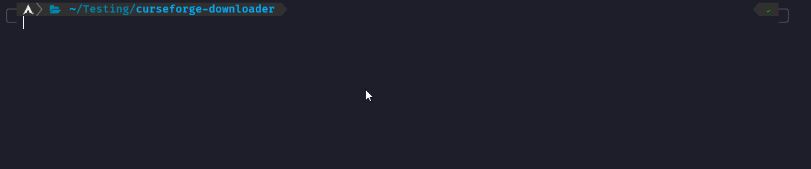

# **NOTE**
This only works with packs that have a published server pack.
This also can break if anything within the curseforge api changes, which is semi probable.

# Info
This is a server pack downloader for minecraft CurseForge.
You can see all the arguments and what they do by using the ``--help`` parameter.

# Example

# Compiling
Clone the repo and then run `cargo build --release`.
Then you can just simply run that executable.